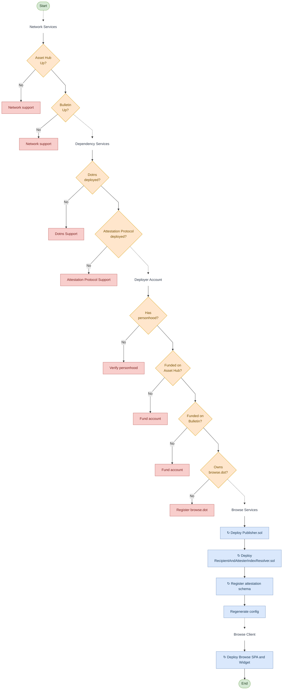

# One-command deployment

Stand up a full browse instance on a network with a single pipeline, instead of manual deploys and hand-edited config.

## Goal

```sh
NETWORK_GENESIS_HASH=0x... MNEMONIC="..." bun run deploy
```

For a target network, this checks the preconditions, deploys the browse-owned contracts, records their addresses, regenerates the client config, builds the app for that network, publishes it, and seeds the directory. Re-running it stays idempotent.

## Overview



## The pipeline

Order matters. Each step depends on the one before. 

1. Check network services. Resolve `NETWORK_GENESIS_HASH` and confirm the programs RPC and storage RPC respond.
2. Check the DotNS contracts. They must be deployed at their addresses in the browse-sdk config, from [paritytech/dotns](https://github.com/paritytech/dotns):

   | Config key | DotNS contract |
   |---|---|
   | `REGISTRAR` | [DotnsRegistrar.sol](https://github.com/paritytech/dotns/blob/master/contracts/registrars/DotnsRegistrar.sol) |
   | `REGISTRY` | [DotnsRegistry.sol](https://github.com/paritytech/dotns/blob/master/contracts/registry/DotnsRegistry.sol) |
   | `CONTENT_RESOLVER` | [DotnsContentResolver.sol](https://github.com/paritytech/dotns/blob/master/contracts/resolvers/DotnsContentResolver.sol) |
   | `STORE_FACTORY` | [StoreFactory.sol](https://github.com/paritytech/dotns/blob/master/contracts/store/StoreFactory.sol) |
   | `MULTICALL3` | [Multicall3.sol](https://github.com/paritytech/dotns/blob/master/contracts/utils/Multicall3.sol) |
   
3. Check the Attestation Protocol contracts. They must be deployed at their addresses in the browse-sdk config, from [paritytech/attestation-protocol](https://github.com/paritytech/attestation-protocol):

   | Config key | Attestation contract |
   |---|---|
   | `SCHEMA_REGISTRY` | [SchemaRegistry.sol](https://github.com/paritytech/attestation-protocol/blob/main/evm/contracts/SchemaRegistry.sol) |
   | `ATTESTATION_SERVICE` | [AttestationService.sol](https://github.com/paritytech/attestation-protocol/blob/main/evm/contracts/AttestationService.sol) |
4. Check the deployer account. Confirm it exists, is funded, and is mapped on the target network.
5. Deploy `Publisher`, passing the registrar from [the browse-sdk config](../packages/browse-sdk/src/config.ts). Write the address to the manifest.
6. Deploy the resolver, passing the AttestationService. Write the address to the manifest.
7. Register the schema in SchemaRegistry. Write the `SCHEMA_ID` to the manifest.
8. Regenerate the SDK config from the manifest.
9. Build the app for the network with `NETWORK_GENESIS_HASH=<genesis> bun run build`.
10. Publish to the Bulletin chain with `bulletin-deploy --publish --env <matching>`. This uploads app and widget to `browse.dot` and lists it in the Publisher registry.
11. Seed the directory with `publish-app` for each starter label.
